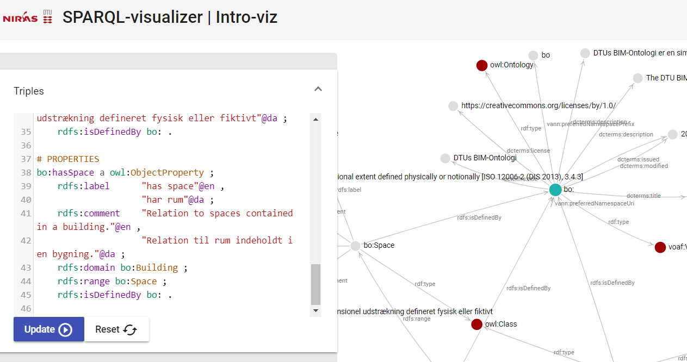
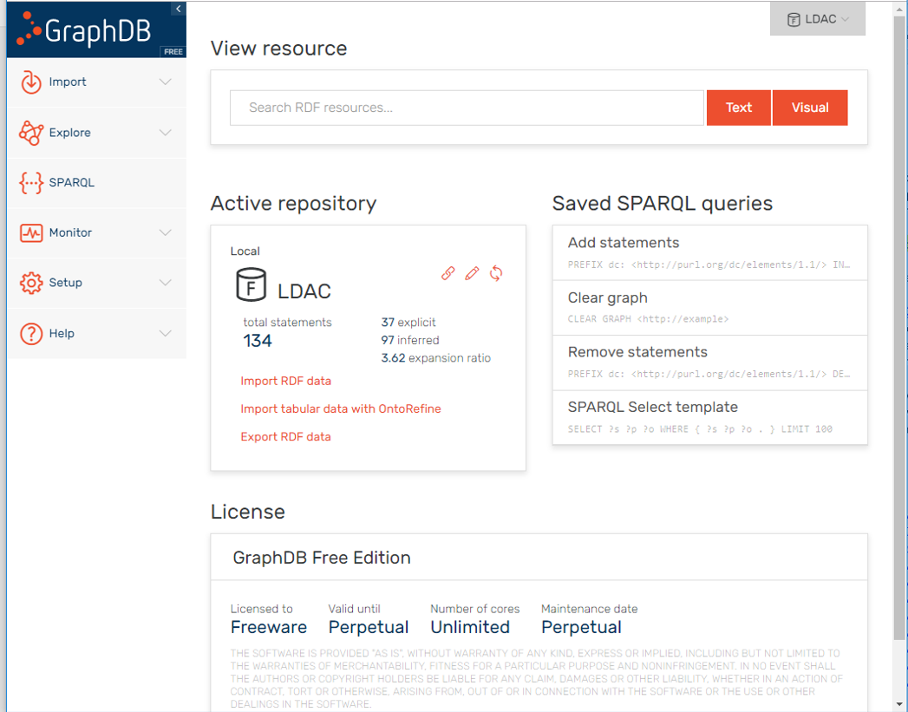
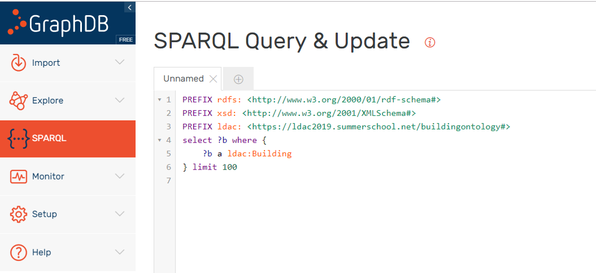

# Intro to Linked Data and Semantic Web: the Basics

Pieter Pauwels, Ghent University

Mads Holten Rasmussen, NIRAS

The first session of the LDAC summer school is about the vision and basics of the Semantic Web and Linked Data. You will be introduced to Linked Data in general, and with the work of the Linked Building Data (LBD) community group in particular. Through a number of slides, you will be introduced to the technical basics. More specifically, this session introduces the concept of linked data, graphs, ontologies, and graph-based information modelling in general. 

Through the exercises listed in this document, you’ll learn to think in terms of graphs about the built environment that surrounds you. More particularly, you will apply this to the room in which you are currently in. Furthermore, you’ll learn how to represent this room in an RDF graph, and you’ll be introduced to the concept of ontologies and vocabularies.

### Learning objectives
-	Understand the principles of Linked (Building) Data (LBD)
-	Understand the basics on what information can be described in ontologies
-	Construct an LBD-compliant RDF graph

## ASSIGNMENT 1 – WHERE IN THE GRAPH ARE WE???
Our environment can be described in many ways. Let’s describe our environment in a graph!

### Task 1.1
Take pen and paper and post-its. Define with nodes and arcs what building and space we are in.

Remember:
-	Nodes are in ellipses; literals are in rectangles
-	Every arc needs a label
-	Every element in the room needs to have a URI


### Task 1.2 
Evaluate: 
-	What terms did you use? 
-	What is vocabulary, what is data?
-	What could be re-used or defined by others?
-	Does every ‘thing’ have its own identifier or node?
-	Where are literals and where are nodes?

### Task 1.3
Evaluate: what kind of data was difficult to represent in a graph? What kind of data was easy to represent in a graph?

-	Did you include geometry?
-	Did you include time schedule data?
-	Why (not)?

## ASSIGNMENT 2 – THE VOCABULARY OR ONTOLOGY
An initial ontology or vocabulary file can be found in the shared folder (ldac.ttl). This vocabulary defines a building class, a space class, and a relation between both. This ontology or vocabulary can be used to start defining the environment and elements around you (the ‘data’ or ‘instances’). The vocabulary only defines the overall terminology and definitions that can be used to define concepts and things; it does not define actual things.

### Task 2.1
Open the vocabulary (ldac.ttl) in an online visualization tool (e.g. [WebVOWL](http://www.visualdataweb.de/webvowl/)) and explore what is already defined.

Copy the content of the file into the "Triples" tab of the [SPARQL-visualizer](https://madsholten.github.io/sparql-visualizer/) and explore the full content of the file.

Instructions:
-	Click on the dropdown list and click "1. Sample data"  
-	Open the tabs that appear on the right (Triples, Query, Result). 
-	Change some of the data in the Triples tab, Update, and perform the query again. Notice the differences in the resulting graph. 



Also open the file in Notepad and explore what you see. 

Evaluate
-	What is a namespace?
-	What is a prefix?
-	Is everything unique? Why (not)?
-	What is the difference between ‘.’, ‘;’, and ‘,’?

### Recap
The RDF file is encoded in a syntax called Turtle. Turtle is one of the more human-readable serialization languages for RDF graphs. The two listings below contain the same information and demonstrate how the Turtle syntax provides means to make a more compact and readable file.

```
<https://ldac2019.summerschool.net/buildingontology#Building> <http://www.w3.org/1999/02/22-rdf-syntax-ns#> <http://www.w3.org/2002/07/owl#Class> .
<https://ldac2019.summerschool.net/buildingontology#Building> <http://www.w3.org/2000/01/rdf-schema#label> "Building"@en .
<https://ldac2019.summerschool.net/buildingontology#Building> <http://www.w3.org/2000/01/rdf-schema#label> "Bygning"@da .
```

```
@prefix ldac:       <https://ldac2019.summerschool.net/buildingontology#> .
@prefix owl:        <http://www.w3.org/2002/07/owl#> .
@prefix rdfs:       <http://www.w3.org/2000/01/rdf-schema#> .

bo:Building a owl:Class ;
    rdfs:label      "Building"@en ,
                    "Bygning"@da .
```

Note: In turtle, "a" is a shortcut for rdf:type. This is handy since this predicate is used so often.

Note: graphs in the RDF data model can be described in a number of serialisation formats, namely Turtle, TTL, RDF, etc. Converting between these file formats can be done at: http://www.easyrdf.org/converter.

### Task 2.2 
Add classes and properties to the ontology/vocabulary, using the [Web VOWL editor](http://visualdataweb.de/webvowl_editor/) and/or Notepad (as preferred). Make sure that you have all the vocabulary you need to describe the classroom and/or building of this course.

### Task 2.3
Download the resulting ontology or vocabulary file in the format of your liking to your machine.

### Task 2.4
Validate your vocabulary using the OWL Validator: http://visualdataweb.de/validator/. 


## ASSIGNMENT 3 – THE DATA
Whenever one defines the actual room, building, chair, or anything (namely, the things that have actual physical presence in our surrounding environment), this definition follows a certain vocabulary or ontology (see assignment 1). Such ontologies and vocabularies can be defined using the Web Ontology Language (OWL) and RDF Schema (RDFS). Assignment 2 focused on defining such ontologies. 

Data defined in correspondence with an ontology are called ‘instance data’ or ‘individuals’. They are represented as an RDF graph (see graph in assignment 1). Together, the ontology and the data constitute a ‘knowledge graph’. In this assignment, we will make such data for the current building or room.

### Task 3.1
Open the sample data file (todaysroom.ttl) in NotePad and explore what is already defined. Describe with your own words what the file contains. Relate it to the ontology and the previous discussions on vocabulary vs. data.

```
@prefix rdf: <http://www.w3.org/1999/02/22-rdf-syntax-ns#>
@prefix rdfs: <http://www.w3.org/2000/01/rdf-schema#>
@prefix xsd: <http://www.w3.org/2001/XMLSchema#>
@prefix ldac: <https://ldac2019.summerschool.net/buildingontology#>
@prefix inst: <https://ldac2019.summerschool.net/20190616/YourName#>

inst:thisBuilding
	rdf:type ldac:Building .

inst:thisSpace
	rdf:type ldac:Space .

inst:thisBuilding
	ldac:hasSpace inst:thisSpace .
```

### Task 3.2
Extend the dataset using some of the terms you defined in the ontology in Assignment 2.

### Task 3.3
Copy the content of the sample data file "todaysroom.ttl" in the "Triples" tab of the SPARQL-visualiser and visualize the defined data. What is vocabulary, what is data? Add content in the data tab based on what you have learnt in assignments 1 and 2. Try to define the room as good as possible, and try to query and visualize the data.

### Recap
Note: When using terminology of an ontology in a SPARQL query, the namespace of that ontology must be defined as demonstrated below. Here the prefix “ldac” is defined with the namespace of our ontology. Defining such prefixes in SPARQL is slightly different from defining them in TTL (e.g. PREFIX vs. @prefix).

```
PREFIX ldac: <https://ldac2019.summerschool.net/buildingontology#>

CONSTRUCT
WHERE {
    ?space a ldac:Space .
    ?space ?property ?value .
}
```

The SPARQL-visualizer app uses CONSTRUCT queries by default to construct the graphs that need to be displayed in the visualizer. As another example, the below query can be used to construct a graph that contains everything that is currently in the graph.

```
PREFIX ldac: <https://ldac2019.summerschool.net/buildingontology#>

CONSTRUCT
WHERE {
    ?s ?p ?o .
}
```

## ASSIGNMENT 4 – SCALE UP AND START USING A TRIPLE STORE

### Task 4.1
Install GraphDB for this exercise from http://graphdb.ontotext.com/. GraphDB is a free to use triple store provided by OntoText. It provides all functionality you need to work with RDF graphs more professionally. This triple store can be considered to be a database management systems optimised for RDF graphs. Other triple stores are also available.

### Task 4.2 
Load all data into the GraphDB triple store:

1. start GraphDB and go to http://localhost:7200/

The GraphDB triple store is accessible through your browser. The GraphDB process is listening to port 7200 of your local machine. This is a local installation and all data that you use in this local GraphDB instance remains within your own local machine.



2. Create a new repository:
- Go to Setup > Repositories > Create new Repository
- Name the repository (e.g. ”LDAC”) and click OK

3. Select the created repository as the active repository by clicking its name on the top right of the window

4. Import the sample data file “todaysroom.ttl”:
- Go to Import > RDF > Upload RDF files

### Task 4.3
Explore the data using SPARQL queries and default browsing functionality:

#### Browse the data:
-	Go to Explore > Graphs Overview
-	Click ”The default graph”
-	Select one of the instance nodes (e.g: inst:thisBuilding)
-	Go to ”Visual Graph” at the top right of the window
-	Keep clicking


#### Query the data:
-	Go to "Query" and insert a query like the one below




